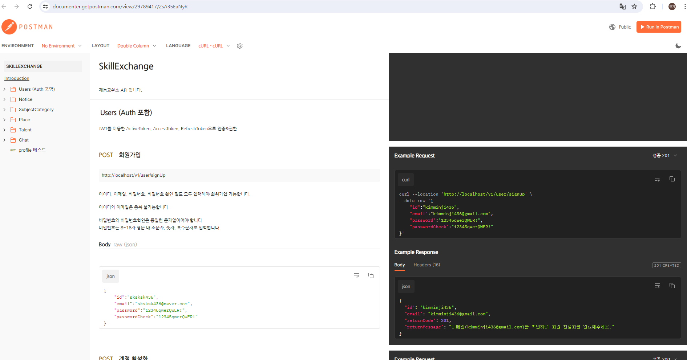
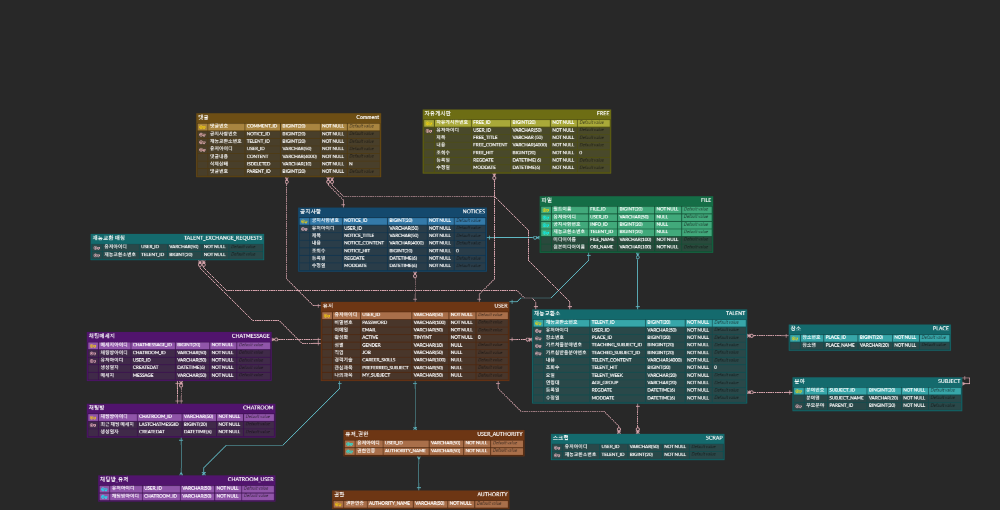

# 재능을 서로 교환하고 연결해주는 플랫폼, 재능교환소

## 🙋‍♀️ 팀원 구성

|                                                               **김민지**                                                               |
|:-----------------------------------------------------------------------------------------------------------------------------------:| 
| [   @10000JI](https://github.com/10000JI) |

 

## 📆 개발기간
- 2024년 02월 01일 ~ 2024년 07월 02일

 

## ✨ 서비스 소개
사용자들이 서로의 재능을 교환할 수 있는 온라인 플랫폼입니다.  
사용자들은 다양한 카테고리에서 재능 교환 게시물을 작성합니다.  
작성된 게시물을 토대로 매칭 서비스를 통해 적합한 파트너를 찾을 수 있습니다.  
관심 있는 상대와 실시간 채팅으로 소통하며, 자발적인 지식과 기술 공유를 촉진합니다.

 

## 🛠️ 개발 환경
#### &nbsp;　[ DB ]
&nbsp;&nbsp;&nbsp;
&nbsp;&nbsp;&nbsp;

#### &nbsp;　[ Backend ]
&nbsp;&nbsp;&nbsp;
&nbsp;&nbsp;&nbsp;
&nbsp;&nbsp;&nbsp;
&nbsp;&nbsp;&nbsp;
&nbsp;&nbsp;&nbsp;
&nbsp;&nbsp;&nbsp;

#### &nbsp;　[ CI/CD ]
&nbsp;&nbsp;&nbsp;
&nbsp;&nbsp;&nbsp;
&nbsp;&nbsp;&nbsp;
&nbsp;&nbsp;&nbsp;

#### &nbsp;　[ AWS ]
&nbsp;&nbsp;&nbsp;
&nbsp;&nbsp;&nbsp;
&nbsp;&nbsp;&nbsp;
&nbsp;&nbsp;&nbsp;

#### &nbsp;　[ Testing ]
&nbsp;&nbsp;&nbsp;
&nbsp;&nbsp;&nbsp;
&nbsp;&nbsp;&nbsp;
&nbsp;&nbsp;&nbsp;
&nbsp;&nbsp;&nbsp; 

 

## 🚀 CI/CD 아키텍처

 

## 📺 API 명세서

https://documenter.getpostman.com/view/29789417/2sA35EaNyR

 

## 📝 DB구조도

 

## 💻 기능정리
1. 회원 (일반회원 & OAuth2.0)
2. 공지사항
3. 재능교환 게시물
4. 댓글 
5. 채팅
6. 스크랩 및 매칭 서비스