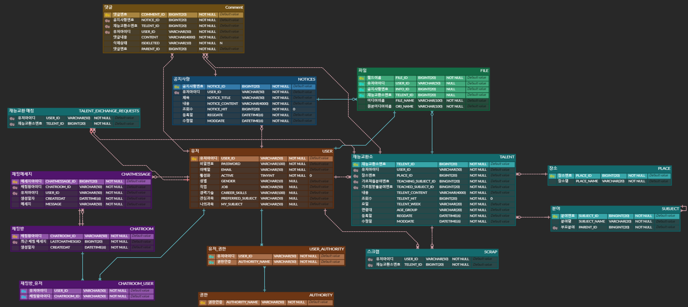

# 재능을 서로 교환하고 연결해주는 플랫폼, 재능교환소

## 🙋‍♀️ 팀원 구성

|                                                               **김민지**                                                               |
|:-----------------------------------------------------------------------------------------------------------------------------------:| 
| [   @10000JI](https://github.com/10000JI) |

 

## 📆 개발기간
- 2024년 02월 01일 ~ 2024년 07월 02일

 

## ✨ 서비스 소개
사용자들이 서로의 재능을 교환할 수 있는 온라인 플랫폼입니다.  
사용자들은 다양한 카테고리에서 재능 교환 게시물을 작성합니다.  
작성된 게시물을 토대로 매칭 서비스를 통해 적합한 파트너를 찾을 수 있습니다.  
관심 있는 상대와 실시간 채팅으로 소통하며, 자발적인 지식과 기술 공유를 촉진합니다.

 

## 🛠️ 개발 환경
#### &nbsp;　[ DB ]
&nbsp;&nbsp;&nbsp;
&nbsp;&nbsp;&nbsp;

#### &nbsp;　[ Backend ]
&nbsp;&nbsp;&nbsp;
&nbsp;&nbsp;&nbsp;
&nbsp;&nbsp;&nbsp;
&nbsp;&nbsp;&nbsp;
&nbsp;&nbsp;&nbsp;
&nbsp;&nbsp;&nbsp;

#### &nbsp;　[ CI/CD ]
&nbsp;&nbsp;&nbsp;
&nbsp;&nbsp;&nbsp;
&nbsp;&nbsp;&nbsp;
&nbsp;&nbsp;&nbsp;

#### &nbsp;　[ AWS ]
&nbsp;&nbsp;&nbsp;
&nbsp;&nbsp;&nbsp;
&nbsp;&nbsp;&nbsp;
&nbsp;&nbsp;&nbsp;

#### &nbsp;　[ Testing ]
&nbsp;&nbsp;&nbsp;
&nbsp;&nbsp;&nbsp;
&nbsp;&nbsp;&nbsp;
&nbsp;&nbsp;&nbsp;
&nbsp;&nbsp;&nbsp; 

 

## 🚀 CI/CD 아키텍처

 

## 📺 API 명세서

https://documenter.getpostman.com/view/29789417/2sA35EaNyR

 

## 📝 DB구조도

 

## 💻 수행 내용
#### [ 인증 시스템 구축 ]
- JWT 활용 계정활성화 이메일 인증으로 안전한 회원가입 
- JWT 활용 AccessToken 기반 로그인 시스템 
- OAuth2 활용 소셜 로그인(Kakao, Google) 통합으로 사용자 편의성 증대 
- RDS에서 Redis로 RefreshToken 저장소 전환, 관리 효율성 개선

#### [ 서비스 안정성 및 성능 최적화 ]
- 예외 처리 시스템 고도화• 다형성을 활용한 중앙집중식 예외 처리 구현으로 코드 중복 감소
- JPA N+1 문제 해결, 연관관계 최적화 및 코드 리팩토링
  - OAuth2 활용 소셜 로그인(Kakao, Google) 통합으로 사용자 편의성 증대
- Redis 및 쿠키를 이용한 조회수 중복 방지 로직 구현으로 데이터 정확도 향상

#### [ 인프라 구축 및 배포 프로세스 ]
- CI/CD 파이프라인 구축으로 Nignx를 활용한 무중단 배포
- SonarQube를 통한 정적 코드 분석 자동화

#### [ 실시간 통신 기능 구현 ]
- Spring Boot 기반 1:1 채팅 시스템 개발
- 메시지 큐 시스템(RabbitMQ) 도입으로 메시지 연속성 보장 및 안정성 확보
- 채팅방 목록 및 채팅 메시지에 무한 스크롤 구현

#### [ 보안 강화 및 사용자 데이터 관리 ]
- JWT 블랙리스트 구현으로 AccessToken 악용 가능성 차단
- 소셜 로그인 연동 로그아웃 및 회원탈퇴 프로세스 구현으로 개인정보 보호 강화

#### [ 비즈니스 로직 구현 ]
- 재능교환 게시물 & 공지사항 CRUD 기능 구현으로 서비스의 핵심 기능 완성
- QueryDSL을 활용한 검색 기능 구현
  - 다양한 조건을 조합한 동적 쿼리 생성으로 유연한 검색 기능 제공
  - Cursor 기반 페이징 처리
- 자기 참조 관계를 활용한 계층형 댓글 시스템
  - 단일 테이블 내 부모-자식 관계 설정으로 대댓글 기능 구현
  - 재귀적 쿼리를 통한 다층 구조의 댓글 조회 최적화
  - 대댓글 깊이에 제한 없는 유연한 구조 설계
- 재능교환 게시물 스크랩 기능 & 매칭 서비스 구현